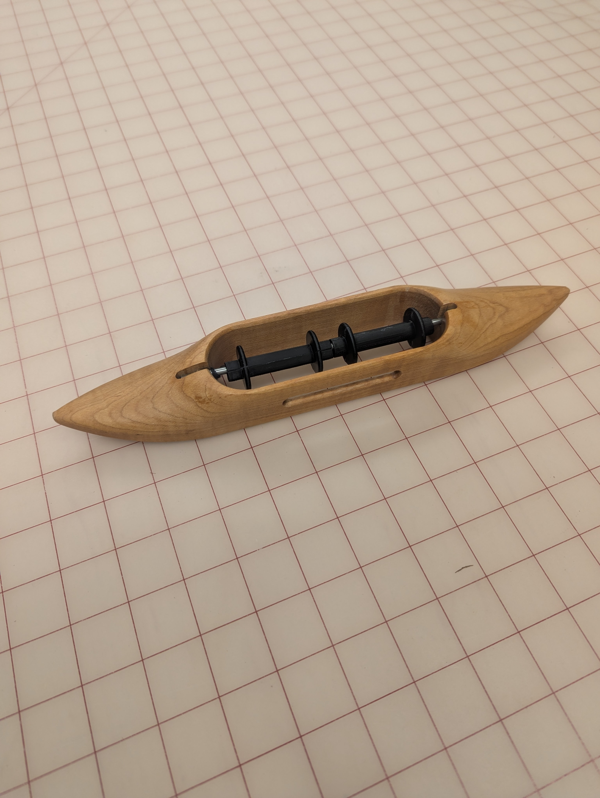
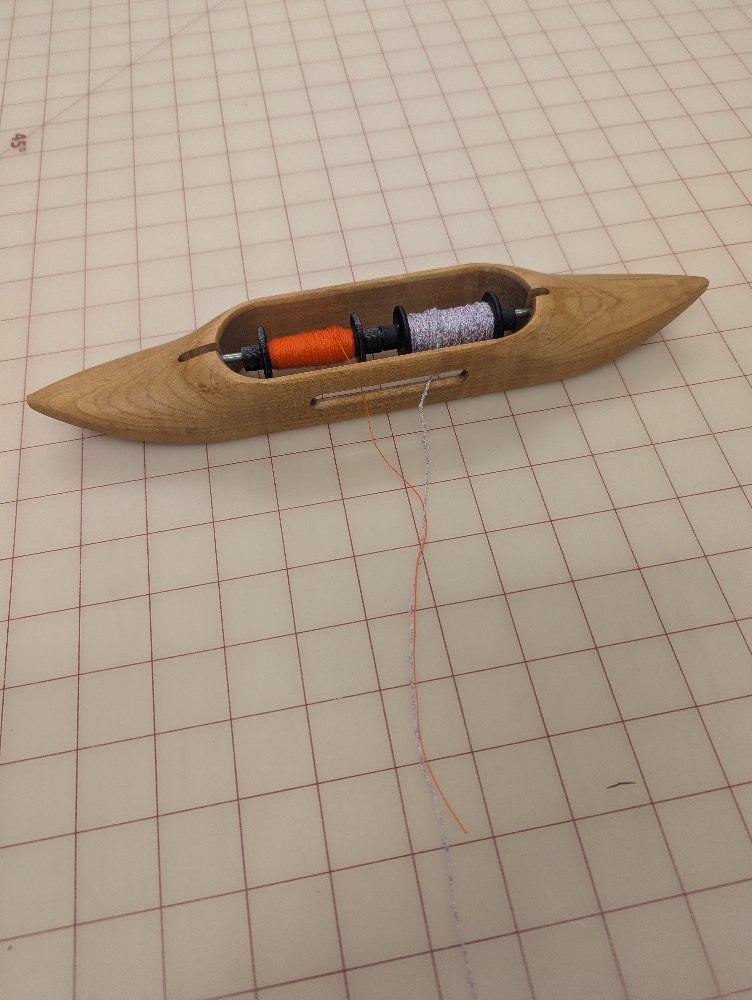

# 3D Printable Mini-Bobbin
This bobbin is printed in two parts and can be glued together. The reuslting bobbin is ~2.5" long. 

## Step 1: Load/Adjust/Print the .STL File on a 3D printer

## Step 2: Glue the Parts Together
with whatever glue works best with your printing material

## Step 3: Wind and Weave
Shown here in a 9" Schacht Boat Shuttle

They are so cute! 
